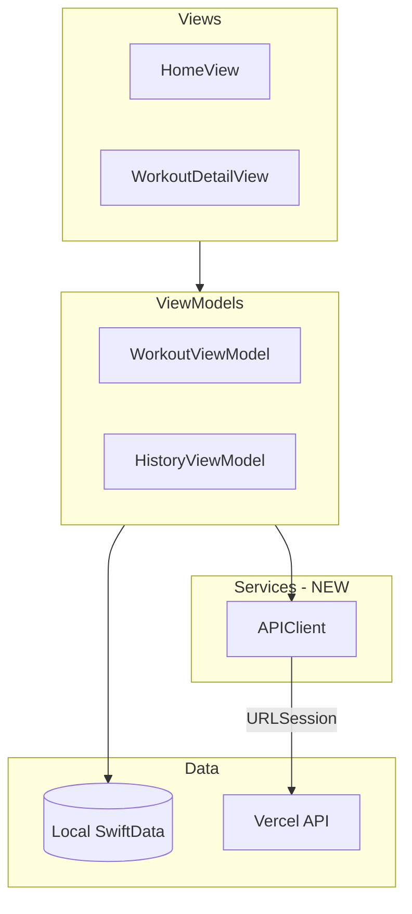
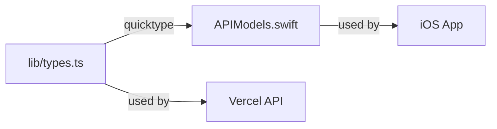

# iOS API Client Integration

## Architecture




## Contract-First Workflow (Uncle Bob Style)




**Single Source of Truth:** `lib/types.ts` defines the API contract.

**When API changes:**

1. Update `lib/types.ts`
2. Run `npm run generate:swift`
3. Swift types are automatically regenerated
4. Compiler catches any breaking changes in iOS code

## Quicktype Setup

Add to `package.json`:

```json
"devDependencies": {
  "quicktype": "^23.0.0"
},
"scripts": {
  "generate:swift": "quicktype lib/types.ts -o WorkoutTracker/Services/APIModels.swift --lang swift --just-types --acronym-style original"
}
```

## Files to Create

```
WorkoutTracker/
├── Services/
│   ├── APIClient.swift      # URLSession networking
│   └── APIModels.swift      # Generated by quicktype (DO NOT EDIT)
```

## API Client Design

### APIModels.swift (Generated)

Quicktype generates Codable structs from TypeScript interfaces:

- `Exercise`, `CreateExerciseInput`, `UpdateExerciseInput`
- `WorkoutLog`, `CreateWorkoutLogInput`, `UpdateWorkoutLogInput`
- `ContentNote`, `CreateContentNoteInput`, `UpdateContentNoteInput`

### APIClient.swift

Singleton with async/await methods:

```swift
class APIClient {
    static let shared = APIClient()
    private let baseURL = "https://workout-tracker-jim-brews-projects.vercel.app"
    
    // Exercises
    func fetchExercises() async throws -> [APIExercise]
    func createExercise(_ input: CreateExerciseRequest) async throws -> APIExercise
    func updateExercise(id: String, _ input: UpdateExerciseRequest) async throws -> APIExercise
    func deleteExercise(id: String) async throws
    
    // Logs
    func fetchLogs() async throws -> [APIWorkoutLog]
    func createLog(_ input: CreateLogRequest) async throws -> APIWorkoutLog
    
    // Notes
    func fetchNotes() async throws -> [APIContentNote]
    func createNote(_ input: CreateNoteRequest) async throws -> APIContentNote
}
```

## Integration Points

1. **[WorkoutViewModel.swift](WorkoutTracker/ViewModels/WorkoutViewModel.swift)** - Add sync methods:
  - `syncExercisesFromAPI()` - fetch from API, update local SwiftData
  - `logWorkout()` - also POST to API after local save
2. **[HistoryViewModel.swift](WorkoutTracker/ViewModels/HistoryViewModel.swift)** - Add:
  - `syncLogsFromAPI()` - fetch logs from API

## Sync Strategy (Local-First)

- SwiftData remains the source of truth for the UI
- API calls happen in the background
- On app launch or pull-to-refresh, sync from API
- When creating/updating data, save locally first, then push to API

## Base URL

Hardcoded in APIClient for now (single user app):

```swift
private let baseURL = "https://workout-tracker-jim-brews-projects.vercel.app"
```

