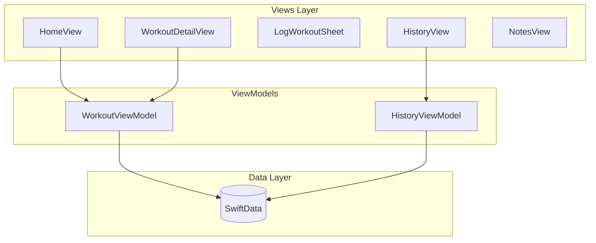

# iOS Workout Tracker App

## Architecture




## Data Models (SwiftData)

- **WorkoutType**: Enum (A, B) defining the two workout days
- **Exercise**: Name, target weight, target reps, notes, linked to workout type
- **WorkoutLog**: Date, exercise reference, actual weight, actual reps, feeling (1-5 scale), notes
- **ContentNote**: Title, body text, optional URL links

## Screens

1. **Home** - Next scheduled workout, days since last workout, quick access to A/B
2. **Workout Detail** - List exercises for A or B, show goals, button to log
3. **Log Workout Sheet** - Record actual weight/reps, feeling slider, notes
4. **History** - Calendar or list view of past workouts with progress indicators
5. **Notes** - Informative content, links to videos/posts

## Project Structure

```
WorkoutTracker/
├── WorkoutTrackerApp.swift
├── Models/
│   ├── WorkoutType.swift
│   ├── Exercise.swift
│   ├── WorkoutLog.swift
│   └── ContentNote.swift
├── ViewModels/
│   ├── WorkoutViewModel.swift
│   └── HistoryViewModel.swift
├── Views/
│   ├── HomeView.swift
│   ├── WorkoutDetailView.swift
│   ├── LogWorkoutSheet.swift
│   ├── HistoryView.swift
│   ├── NotesView.swift
│   └── Components/
│       ├── ExerciseRow.swift
│       └── WorkoutCard.swift
├── Theme/
│   └── AppTheme.swift
└── Preview Content/
    └── SampleData.swift
```

## Design System

- **Colors**: Dark background (#121212), accent color for CTAs, muted grays for secondary text
- **Typography**: SF Pro with clear hierarchy (title, body, caption)
- **Components**: Cards with subtle borders, minimal shadows, consistent spacing

## Implementation Order

1. Create Xcode project with SwiftUI + SwiftData
2. Define data models
3. Build theme/design system
4. Create Home view with workout cards
5. Build Workout Detail view with exercise list
6. Add Log Workout sheet with form
7. Implement History view
8. Add Notes section
9. Seed initial A/B workout data

## Initial Workout Data (Mentzer-style)

**Workout A:**

- Squats
- Calf Raises

**Workout B:**

- Palm up, narrow grip, pull ups
- Dips
- Overhead Press

