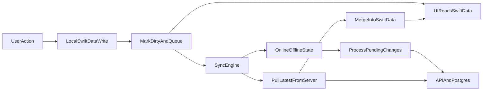

# Offline-First SwiftData Plan

## Goal

Make the local SwiftData store the single source of truth for UI and business logic, and make backend sync durable, retryable, conflict-tolerant, and safe across reinstalls.

## Architecture Shift

## Phase 1: Model Metadata And Migration

Update all persisted models to carry sync metadata while preserving existing user fields.

Files:

- [WorkoutTracker/Models/Exercise.swift](/Users/gizmo/Documents/Code/workout-tracker/WorkoutTracker/Models/Exercise.swift)
- [WorkoutTracker/Models/WorkoutLog.swift](/Users/gizmo/Documents/Code/workout-tracker/WorkoutTracker/Models/WorkoutLog.swift)
- [WorkoutTracker/Models/BodyWeightEntry.swift](/Users/gizmo/Documents/Code/workout-tracker/WorkoutTracker/Models/BodyWeightEntry.swift)
- [WorkoutTracker/Models/ContentNote.swift](/Users/gizmo/Documents/Code/workout-tracker/WorkoutTracker/Models/ContentNote.swift)
- [WorkoutTracker/WorkoutTrackerApp.swift](/Users/gizmo/Documents/Code/workout-tracker/WorkoutTracker/WorkoutTrackerApp.swift)

Changes:

- Add per-record sync fields to every model:
  - `localID: UUID`
  - `remoteID: String?`
  - `serverVersion: Int`
  - `isDirty: Bool`
  - `lastSyncAttempt: Date?`
  - `syncError: String?`
  - `idempotencyKey: UUID`
  - `retryCount: Int`
  - `lastModifiedAt: Date`
- Keep current domain fields and relationships unchanged.
- Use safe default values so existing installs migrate forward without destructive resets.
- Introduce explicit SwiftData schema versioning/migration plumbing in `WorkoutTrackerApp` so future sync metadata changes are controlled instead of implicit.
- Decide and document how current `id` is repurposed:
  - keep `id` for SwiftData identity/relationships if needed
  - standardize `localID` for stable client identity and `remoteID` for server identity
- Add soft-delete support where needed for durable offline deletes:
  - likely `isDeleted` and `deletedAt` on syncable models instead of hard-deleting immediately
  - this is especially important for `Exercise` because current cascade delete would destroy child logs before sync

## Phase 2: Sync Protocol And API Contract

Upgrade the backend contract so the client can sync safely and idempotently.

Files:

- [WorkoutTracker/Services/APIModels.swift](/Users/gizmo/Documents/Code/workout-tracker/WorkoutTracker/Services/APIModels.swift)
- [WorkoutTracker/Services/APIClient.swift](/Users/gizmo/Documents/Code/workout-tracker/WorkoutTracker/Services/APIClient.swift)
- [lib/types.ts](/Users/gizmo/Documents/Code/workout-tracker/lib/types.ts)
- [lib/db.ts](/Users/gizmo/Documents/Code/workout-tracker/lib/db.ts)
- [api/exercises/index.ts](/Users/gizmo/Documents/Code/workout-tracker/api/exercises/index.ts)
- [api/exercises/[id].ts](/Users/gizmo/Documents/Code/workout-tracker/api/exercises/[id].ts)
- [api/logs/index.ts](/Users/gizmo/Documents/Code/workout-tracker/api/logs/index.ts)
- [api/logs/[id].ts](/Users/gizmo/Documents/Code/workout-tracker/api/logs/[id].ts)
- [api/body-weights/index.ts](/Users/gizmo/Documents/Code/workout-tracker/api/body-weights/index.ts)
- [api/body-weights/[id].ts](/Users/gizmo/Documents/Code/workout-tracker/api/body-weights/[id].ts)
- [api/notes/index.ts](/Users/gizmo/Documents/Code/workout-tracker/api/notes/index.ts)
- [api/notes/[id].ts](/Users/gizmo/Documents/Code/workout-tracker/api/notes/[id].ts)

Changes:

- Extend every entity contract to accept and return:
  - `remoteID`
  - `clientUpdatedAt` or `clientVersion`
  - `serverVersion`
  - `updatedAt`
  - `deletedAt` for tombstones
- Add idempotency key handling on mutation requests.
- Make server mutation handlers return the authoritative `remoteID`, `serverVersion`, and timestamps.
- Add support for `?since=` or equivalent delta fetches per entity; full fetch fallback remains acceptable because dataset is small.
- Add tombstone-aware list responses so deleted remote records reconcile locally.
- Normalize notes to the same sync behavior as exercises/logs/body weights.
- Fix current contract drift:
  - consistent feeling range
  - `WorkoutLog` joined fields typing
  - stable update semantics for logs/body-weight entries

## Phase 3: New Offline-First SyncEngine

Replace the current best-effort sync layer with a durable queue-driven engine.

Files:

- [WorkoutTracker/Services/SyncEngine.swift](/Users/gizmo/Documents/Code/workout-tracker/WorkoutTracker/Services/SyncEngine.swift)
- new helper files under `WorkoutTracker/Services/` if needed for organization

Core responsibilities:

- `queueForSync(_:)`
  - mark record dirty
  - update `lastModifiedAt`
  - reset retry state as appropriate
  - save immediately
- `processPendingChanges()`
  - query dirty records by entity type
  - push creates/updates/deletes with idempotency headers
  - on success: update `remoteID`, `serverVersion`, `isDirty = false`, `syncError = nil`, `retryCount = 0`
  - on failure: set `lastSyncAttempt`, increment retry count, store `syncError`, keep record dirty
- `pullLatestFromServer()`
  - fetch remote deltas/full datasets for all entities
  - merge using last-write-wins with server timestamp/version precedence
  - preserve local pending edits when local record is newer and still dirty
- `syncNow()` orchestration
  - pull first on fresh install/foreground
  - then process pending changes
  - optionally re-pull after pushes if needed to refresh authoritative versions
- real-time connectivity using `NWPathMonitor`
- observable sync state for UI:
  - online/offline
  - pending count
  - last sync time
  - current retry/backoff state
  - persistent error banner state

Implementation notes:

- Make the engine `@MainActor` only for published state, while network and merge work can run in isolated async tasks.
- Centralize entity-specific sync adapters so adding a new syncable model is explicit rather than hard-coded in many places.
- Replace current direct push methods like `pushExercise`, `pushWorkoutLog`, `pushBodyWeight` with queue-based entry points.

## Phase 4: Network Stack Hardening

Make sync survive suspension and poor connectivity.

Files:

- [WorkoutTracker/Services/APIClient.swift](/Users/gizmo/Documents/Code/workout-tracker/WorkoutTracker/Services/APIClient.swift)

Changes:

- Split read and sync sessions if useful:
  - standard `URLSession` for foreground reads
  - background `URLSessionConfiguration.background(...)` for queued sync work
- Set `waitsForConnectivity = true`.
- Add exponential backoff with 30-second base delay and max 5 attempts.
- Send idempotency headers on every mutation.
- Keep request building typed and entity-specific so version/timestamp headers are always attached.

## Phase 5: Refactor All Write Paths

Every write path should only mutate SwiftData, then queue the changed model.

Files to change:

- [WorkoutTracker/ViewModels/WorkoutViewModel.swift](/Users/gizmo/Documents/Code/workout-tracker/WorkoutTracker/ViewModels/WorkoutViewModel.swift)
- [WorkoutTracker/ViewModels/HistoryViewModel.swift](/Users/gizmo/Documents/Code/workout-tracker/WorkoutTracker/ViewModels/HistoryViewModel.swift)
- [WorkoutTracker/ViewModels/ProgressViewModel.swift](/Users/gizmo/Documents/Code/workout-tracker/WorkoutTracker/ViewModels/ProgressViewModel.swift)
- [WorkoutTracker/Views/Components/AddBodyWeightSheet.swift](/Users/gizmo/Documents/Code/workout-tracker/WorkoutTracker/Views/Components/AddBodyWeightSheet.swift)
- [WorkoutTracker/Views/NotesView.swift](/Users/gizmo/Documents/Code/workout-tracker/WorkoutTracker/Views/NotesView.swift)
- any delete flows in [WorkoutTracker/Views/WorkoutDetailView.swift](/Users/gizmo/Documents/Code/workout-tracker/WorkoutTracker/Views/WorkoutDetailView.swift) that need soft-delete semantics

Changes:

- Remove fire-and-forget direct network calls from view models and sheets.
- After each local mutation, call the shared sync engine queue method.
- Convert deletes from immediate hard deletes to soft deletes where required for reliable remote reconciliation.
- Ensure views continue to read only from SwiftData-derived view models so UI stays instant offline.

## Phase 6: Lifecycle And Background Sync

Run sync automatically at the right times without adding new screens.

Files:

- [WorkoutTracker/WorkoutTrackerApp.swift](/Users/gizmo/Documents/Code/workout-tracker/WorkoutTracker/WorkoutTrackerApp.swift)
- [WorkoutTracker/ContentView.swift](/Users/gizmo/Documents/Code/workout-tracker/WorkoutTracker/ContentView.swift)
- app config for background task registration if required by current app structure

Changes:

- Add `scenePhase` handling for foreground activation.
- On first launch after reinstall or app activation:
  - if online, run `pullLatestFromServer()` then `processPendingChanges()`
- Register a BG processing task for sync.
- Schedule background sync when there are pending changes and the device conditions are acceptable.
- Remove or gate `SampleData.seedExercises(...)` so production installs never overwrite or mask real synced state.

## Phase 7: Minimal Sync Status UI

Add one reusable sync indicator and one persistent lightweight error banner.

Files:

- new reusable view, e.g. `WorkoutTracker/Views/Components/SyncStatusIndicator.swift`
- [WorkoutTracker/Views/HomeView.swift](/Users/gizmo/Documents/Code/workout-tracker/WorkoutTracker/Views/HomeView.swift)
- [WorkoutTracker/Views/HistoryView.swift](/Users/gizmo/Documents/Code/workout-tracker/WorkoutTracker/Views/HistoryView.swift)
- [WorkoutTracker/Views/Progress/ProgressView.swift](/Users/gizmo/Documents/Code/workout-tracker/WorkoutTracker/Views/Progress/ProgressView.swift)
- [WorkoutTracker/ContentView.swift](/Users/gizmo/Documents/Code/workout-tracker/WorkoutTracker/ContentView.swift)

Changes:

- Add a small reusable cloud icon in the nav bar or shared chrome.
- States:
  - green for synced
  - gray for pending/offline
  - red for persistent error after retries
- Tap target shows pending count and last sync time.
- Add a subtle persistent banner for “Sync failed, will retry” driven by sync engine state.
- Keep current dark/minimal visual language.

## Phase 8: Testing

Add coverage around queueing, retries, merges, and reinstall safety.

Files:

- [WorkoutTrackerTests/SyncEngineTests.swift](/Users/gizmo/Documents/Code/workout-tracker/WorkoutTrackerTests/SyncEngineTests.swift)
- additional test files under `WorkoutTrackerTests/` as needed

Tests:

- queueing marks records dirty and preserves local writes immediately
- successful push clears dirty state and stores remote metadata
- failed push increments retry count and keeps records pending
- exponential backoff behavior caps at 5 attempts
- pull merge honors last-write-wins using server version/timestamp
- tombstone merge removes or hides deleted records correctly
- reinstall/bootstrap path restores server-backed data and does not seed fake exercises into production state
- mocked network conditions simulate offline/online transitions

## Implementation Order

1. Model metadata + migration plumbing
2. API contract/database changes for versioning, idempotency, and tombstones
3. New `SyncEngine` and network client upgrades
4. Refactor all write sites to queue instead of pushing directly
5. App lifecycle + background task registration
6. Reusable sync indicator and retry banner
7. Tests and verification

## First Deliverable

Start with:

- updated SwiftData models and migration-safe defaults
- the new `SyncEngine.swift` skeleton plus core queue/pull/process workflow

Those two pieces establish the offline-first foundation before refactoring the write sites and UI.