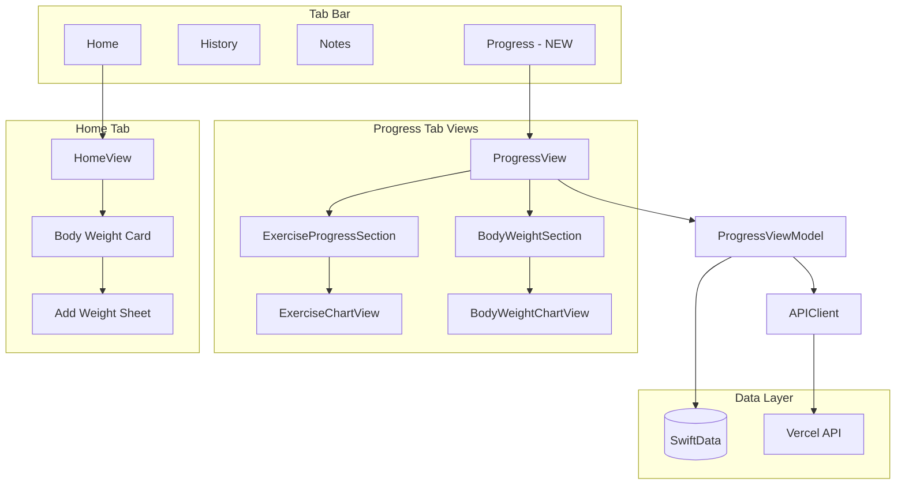

# Progress Tracking and Charts Feature

## Overview

Add a dedicated **Progress tab** to the app with:

1. **Exercise progress charts** - visualize weight and reps improvements over time
2. **Body weight tracking** - manual entry with progress chart

Uses **Swift Charts** (native iOS 16+) for all visualizations.

## Architecture



**Body weight entry** lives on the Home tab (convenient for daily logging), while **charts and history** are viewed in the Progress tab.


## Data Model Changes

### New `BodyWeight` Model

**SwiftData** ([WorkoutTracker/Models/BodyWeight.swift](WorkoutTracker/Models/BodyWeight.swift)):

```swift
@Model
final class BodyWeight {
    var id: UUID
    var date: Date
    var weight: Double  // in user's preferred unit
    var notes: String
}
```

**Postgres** ([lib/db.ts](lib/db.ts)):

```sql
CREATE TABLE body_weights (
  id UUID PRIMARY KEY DEFAULT gen_random_uuid(),
  date TIMESTAMP WITH TIME ZONE NOT NULL,
  weight DECIMAL(10, 2) NOT NULL,
  notes TEXT DEFAULT '',
  created_at TIMESTAMP WITH TIME ZONE DEFAULT CURRENT_TIMESTAMP
);
```

**TypeScript types** ([lib/types.ts](lib/types.ts)):

```typescript
export interface BodyWeight {
  id: string;
  date: string;
  weight: number;
  notes: string;
  created_at: string;
}
```

## API Endpoints

New endpoints in `api/body-weights/`:


| Endpoint                 | Methods          | Purpose                                             |
| ------------------------ | ---------------- | --------------------------------------------------- |
| `/api/body-weights`      | GET, POST        | List entries (with `limit`, `offset`), create entry |
| `/api/body-weights/[id]` | GET, PUT, DELETE | Single entry CRUD                                   |


## iOS Views

### View Structure

**Home Tab** - Add body weight entry card:

```
WorkoutTracker/Views/
├── HomeView.swift                  # Add BodyWeightCard component
└── Components/
    ├── BodyWeightCard.swift        # Shows current weight + "Log Weight" button
    └── AddBodyWeightSheet.swift    # Manual entry form (date, weight, notes)
```

**Progress Tab** - Charts and visualization:

```
WorkoutTracker/Views/Progress/
├── ProgressView.swift              # Main tab view
├── ExerciseProgressSection.swift   # Exercise picker + chart
├── ExerciseChartView.swift         # Weight/reps line chart for one exercise
├── BodyWeightSection.swift         # Body weight history + chart
└── BodyWeightChartView.swift       # Body weight trend chart
```

### Chart Design

**Exercise Progress Chart** (per exercise):

- Dual-axis line chart showing weight (primary) and reps (secondary) over time
- Trend line showing improvement direction
- Green highlighting when surpassing previous records
- Date range picker (last 30 days, 90 days, all time)

**Body Weight Chart**:

- Clean line chart with data points
- Goal line if user sets a target
- Trend indicator (up/down arrow with percentage)
- Same date range options

### Encouraging Elements

- "Personal Best" badges when hitting new highs
- Streak indicators for consistent logging
- Positive color gradients (green for improvements)
- Motivational messages based on trends

## Key Files to Modify


| File                                                              | Changes                                        |
| ----------------------------------------------------------------- | ---------------------------------------------- |
| [ContentView.swift](WorkoutTracker/ContentView.swift)             | Add Progress tab (4th tab)                     |
| [WorkoutTrackerApp.swift](WorkoutTracker/WorkoutTrackerApp.swift) | Register `BodyWeight` in ModelContainer schema |
| [HomeView.swift](WorkoutTracker/Views/HomeView.swift)             | Add BodyWeightCard for daily weight logging    |
| [lib/db.ts](lib/db.ts)                                            | Add `body_weights` table creation              |
| [lib/types.ts](lib/types.ts)                                      | Add `BodyWeight` interfaces                    |
| [APIClient.swift](WorkoutTracker/Services/APIClient.swift)        | Add body weight API methods                    |
| [package.json](package.json)                                      | Re-run quicktype after type changes            |


## Key Files to Create


| File                                                       | Purpose                                     |
| ---------------------------------------------------------- | ------------------------------------------- |
| `WorkoutTracker/Models/BodyWeight.swift`                   | SwiftData model                             |
| `WorkoutTracker/ViewModels/ProgressViewModel.swift`        | Data aggregation and chart prep             |
| `WorkoutTracker/Views/Components/BodyWeightCard.swift`     | Home tab card with current weight + log btn |
| `WorkoutTracker/Views/Components/AddBodyWeightSheet.swift` | Entry form (date, weight, notes)            |
| `WorkoutTracker/Views/Progress/ProgressView.swift`         | Main progress tab                           |
| `WorkoutTracker/Views/Progress/ExerciseChartView.swift`    | Swift Charts exercise visualization         |
| `WorkoutTracker/Views/Progress/BodyWeightChartView.swift`  | Swift Charts body weight visualization      |
| `api/body-weights/index.ts`                                | List/create endpoints                       |
| `api/body-weights/[id].ts`                                 | Single entry CRUD                           |


## Implementation Notes

- **Swift Charts** is available on iOS 16+ (already the app's minimum target based on SwiftData usage)
- Charts will query existing `WorkoutLog` data - no new exercise logging needed
- Body weight syncs to API like exercises/logs (local-first with background sync)
- Date grouping aggregates multiple logs per day to single chart point (using max weight/reps)

