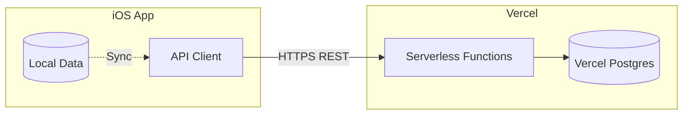

# Vercel Backend Setup

## Architecture




## Monorepo Structure

```
workout-tracker/
├── WorkoutTracker/           # iOS app (existing)
├── WorkoutTracker.xcodeproj/ # Xcode project (existing)
├── api/                      # Vercel serverless functions (NEW)
│   ├── exercises/
│   │   ├── index.ts          # GET all, POST new
│   │   └── [id].ts           # GET/PUT/DELETE by id
│   ├── logs/
│   │   ├── index.ts          # GET all, POST new
│   │   └── [id].ts           # GET/PUT/DELETE by id
│   └── notes/
│       ├── index.ts
│       └── [id].ts
├── lib/                      # Shared utilities
│   ├── db.ts                 # Database connection
│   └── types.ts              # TypeScript types
├── package.json              # Node dependencies
├── tsconfig.json             # TypeScript config
├── vercel.json               # Vercel configuration
└── docs/
```

## API Endpoints


| Method | Endpoint             | Description                      |
| ------ | -------------------- | -------------------------------- |
| GET    | `/api/exercises`     | List all exercises               |
| POST   | `/api/exercises`     | Create exercise                  |
| GET    | `/api/exercises/:id` | Get single exercise              |
| PUT    | `/api/exercises/:id` | Update exercise                  |
| DELETE | `/api/exercises/:id` | Delete exercise                  |
| GET    | `/api/logs`          | List workout logs (with filters) |
| POST   | `/api/logs`          | Create workout log               |
| GET    | `/api/logs/:id`      | Get single log                   |
| PUT    | `/api/logs/:id`      | Update log                       |
| DELETE | `/api/logs/:id`      | Delete log                       |
| GET    | `/api/notes`         | List notes                       |
| POST   | `/api/notes`         | Create note                      |
| PUT    | `/api/notes/:id`     | Update note                      |
| DELETE | `/api/notes/:id`     | Delete note                      |


## Database Schema (Vercel Postgres)

Tables mirror the SwiftData models:

- **exercises**: id, name, target_weight, target_reps, notes, workout_type, order_index, created_at, updated_at
- **workout_logs**: id, exercise_id, date, actual_weight, actual_reps, feeling, notes, created_at
- **content_notes**: id, title, body, url, created_at, updated_at

## Implementation Steps

1. **Initialize Node.js project** - Add package.json with dependencies (typescript, @vercel/postgres, etc.)
2. **Configure Vercel** - Add vercel.json to route `/api/`* to serverless functions
3. **Set up database utilities** - Create lib/db.ts with Postgres connection and query helpers
4. **Create API routes** - Implement CRUD endpoints for exercises, logs, and notes
5. **Add iOS networking layer** - Create an APIClient in Swift that calls these endpoints

## Deployment

1. Link this folder to a Vercel project: `vercel link`
2. Add Vercel Postgres from the Vercel dashboard (Storage > Create Database)
3. Environment variables are automatically injected
4. Deploy: `vercel --prod` or push to connected Git branch

## iOS Integration (Later)

The iOS app will get a new `Services/APIClient.swift` that:

- Makes URLSession requests to the Vercel endpoints
- Handles JSON encoding/decoding
- Syncs local SwiftData with remote Postgres

